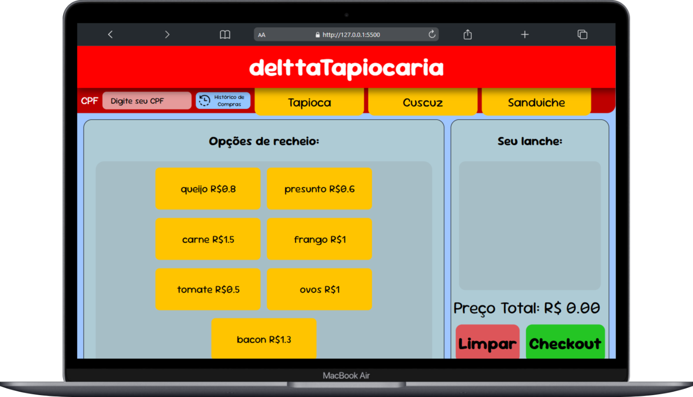
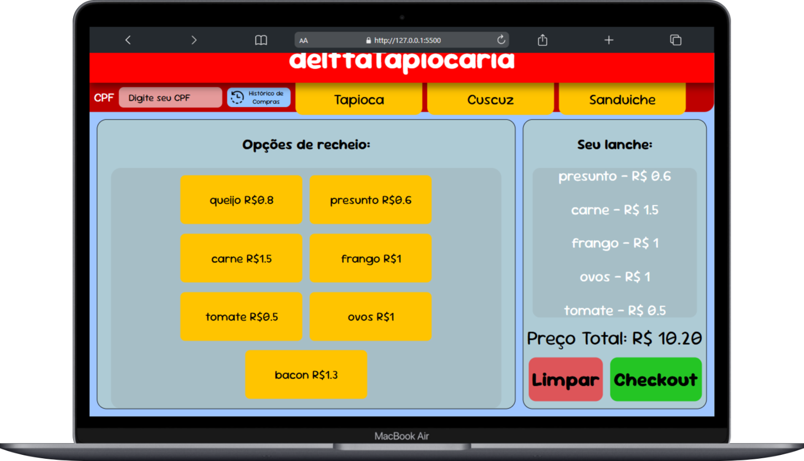
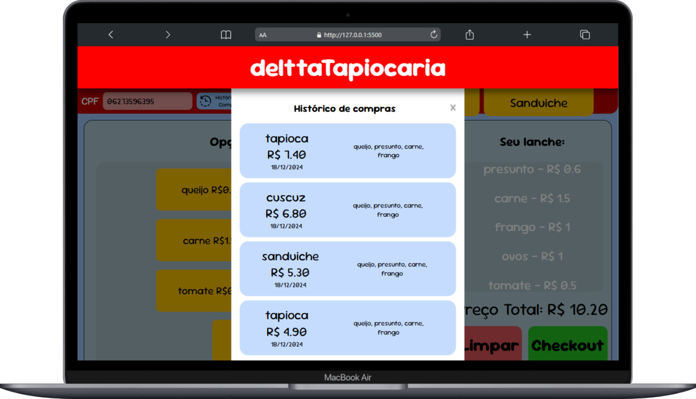

# 🌮 delttaTapiocaria

Um projeto desenvolvido como parte de uma avaliação de Desenvolvimento Web, permitindo aos usuários explorar opções de tapiocas e seus recheios favoritos, criar pedidos e visualizar o histórico de compras.

## 📋 Índice

- [Descrição do Projeto](#descrição-do-projeto)
- [Funcionalidades](#funcionalidades)
- [Tecnologias Utilizadas](#tecnologias-utilizadas)
- [Como Usar](#como-usar)
- [Endpoints da API](#endpoints-da-api)
- [Estrutura do Banco de Dados](#estrutura-do-banco-de-dados)
- [Como Executar o Projeto Localmente](#como-executar-o-projeto-localmente)
- [Contribuição](#contribuição)
- [Licença](#licença)
- [Contato](#contato)

## 📌 Descrição do Projeto

O **delttaTapiocaria** é um site interativo que permite aos usuários explorar e personalizar opções de tapiocas, cuscuz e sanduíches. Com uma interface intuitiva, a plataforma é ideal para quem deseja personalizar seus lanches de forma prática.

## 🫡 Funcionalidades

- **Busca por CPF**: Permite ao usuário inserir seu CPF para acessar seu histórico de pedidos passados.
- **Histórico de Compras**: Apresenta um modal com o histórico de compras baseado no CPF informado.
- **Escolha de Produtos**: Navegação entre abas de produtos (Tapioca, Cuscuz e Sanduíche) para explorar opções.
- **Opções de Recheios**: Lista de recheios disponíveis para personalizar cada produto.
- **Carrinho de Compras**: Exibe os itens selecionados com valor total atualizado em tempo real.
- **Limpar Carrinho**: Botão para remover todos os itens do carrinho.
- **Checkout**: Botão para finalizar o pedido e registrar a compra.

## 🔧 Tecnologias Utilizadas

- **Frontend**:
  - HTML5, CSS3, JavaScript
- **Backend**:
  - Spring Boot (Kotlin)
  - PostgreSQL
- **APIs**:
  - Endpoints RESTful para gerenciamento de alimentos, recheios e vendas.

## 💪 Como Usar

1. Insira seu CPF no campo apropriado.
2. Navegue entre as abas para escolher entre Tapiocas, Cuscuz ou Sanduíches.
3. Selecione os recheios desejados clicando nas opções disponíveis.
4. Confira os itens no carrinho e veja o valor total atualizado.
5. Utilize os botões para limpar o carrinho ou finalizar o pedido.
6. Para visualizar o histórico de compras, clique no botão "Histórico de Compras".

## 🌐 Endpoints da API

### 1. **Obter Recheios por Tipo de Comida**
**Endpoint:** `GET /food`

**Parâmetros de Consulta:**
- `id` (obrigatório): ID do tipo de comida.

**Exemplo de Requisição:**
```http
GET /food?id=1
```

**Exemplo de Resposta (200):**
```json
{
  "basePrice": 5.00,
  "name": "Tapioca",
  "fillings": [
    {"id": 1, "name": "Queijo", "price": 2.00},
    {"id": 2, "name": "Frango", "price": 3.00}
  ]
}
```

**Erros Possíveis:**
- 404: `{"error": "Food with id X not found"}`
- 500: `{"error": "Unexpected error: ..."}`

### 2. **Consultar Histórico de Compras pelo CPF**
**Endpoint:** `GET /history`

**Parâmetros de Consulta:**
- `cpf` (obrigatório): CPF do cliente.

**Exemplo de Requisição:**
```http
GET /history?cpf=12345678900
```

**Exemplo de Resposta (200):**
```json
[
  {
    "id": 1,
    "cpf": "12345678900",
    "food": "Tapioca",
    "description": "Queijo e Frango",
    "price": 10.00,
    "saleDate": "2024-12-18T10:15:30"
  }
]
```

### 3. **Processar Pagamento**
**Endpoint:** `POST /payment`

**Cabeçalhos:**
- `Content-Type: application/json`

**Body:**
```json
{
  "idFood": 1,
  "cpf": "12345678900",
  "saleDate": "2024-12-18T10:15:30",
  "description": "Queijo e Frango",
  "price": 10.00
}
```

**Exemplo de Resposta (201):**
```http
Payment processed successfully!
```

**Erros Possíveis:**
- 404: `{"error": "Food with id X not found"}`
- 400: `{"error": "Error processing payment: ..."}`

## 📸 Screenshots Desktop - (Clique nas imagens para amplia-las)

<div class="desktop">
  
  
  
</div>

## 🗄️ Estrutura do Banco de Dados

### Tabelas

#### 1. **Tabela `foods`**
Armazena os tipos de comidas disponíveis.

```sql
CREATE TABLE foods (
    id INTEGER PRIMARY KEY,
    name VARCHAR,
    price REAL
);
```

**Colunas:**
- `id`: Identificador único.
- `name`: Nome da comida (ex.: Tapioca, Cuscuz, Sanduíche).
- `price`: Preço base da comida.

#### 2. **Tabela `fillings`**
Armazena os recheios disponíveis para cada tipo de comida.

```sql
CREATE TABLE fillings (
    id INTEGER,
    id_food INTEGER,
    name VARCHAR,
    price REAL,
    PRIMARY KEY (id, id_food),
    FOREIGN KEY (id_food) REFERENCES foods (id)
);
```

**Colunas:**
- `id`: Identificador único do recheio.
- `id_food`: Identificador da comida associada.
- `name`: Nome do recheio (ex.: Queijo, Frango).
- `price`: Preço do recheio.

#### 3. **Tabela `sales`**
Registra as vendas realizadas.

```sql
CREATE TABLE sales (
    id SERIAL PRIMARY KEY,
    id_food INTEGER,
    cpf VARCHAR,
    sale_date DATE,
    description VARCHAR(100),
    price REAL,
    FOREIGN KEY (id_food) REFERENCES foods (id)
);
```

**Colunas:**
- `id`: Identificador único da venda.
- `id_food`: Identificador da comida vendida.
- `cpf`: CPF do cliente.
- `sale_date`: Data da venda.
- `description`: Descrição detalhada do pedido.
- `price`: Preço total da venda.

## 💽 Como Executar o Projeto Localmente

1. Clone este repositório:
   ```bash
   git clone https://github.com/gustavodeltta/delttaTapiocaria.git
   ```
2. Navegue até o diretório do projeto:
   ```bash
   cd delttaTapiocaria
   ```
3. Configure o backend:
   - Certifique-se de que o PostgreSQL está instalado e configurado.
   - Atualize as credenciais no `application.properties`.
   - Execute o backend usando um IDE ou o comando:
     ```bash
     ./gradlew bootRun
     ```
4. Inicie o frontend abrindo o arquivo `index.html` em um navegador.

## 🖇️ Contribuição

Contribuições são bem-vindas! Se você deseja colaborar com este projeto:

1. Fork este repositório.
2. Crie uma nova branch (`git checkout -b feature/MinhaNovaFuncionalidade`).
3. Realize suas alterações e faça commit (`git commit -m 'Adiciona uma nova funcionalidade'`).
4. Envie a branch para o repositório remoto (`git push origin feature/MinhaNovaFuncionalidade`).
5. Abra um Pull Request.

## 📄 Licença

Este projeto não possui uma licença definida. Sinta-se livre para utilizar e modificar o código conforme necessário.

## 📩 Contato

Para dúvidas ou sugestões, entre em contato:

- **Nome**: Gustavo Sousa
- **Email**: [deltta.dev@gmail.com](deltta.dev@gmail.com)
- **LinkedIn**: [Perfil no LinkedIn](https://www.linkedin.com/in/gustavodeltta/)
